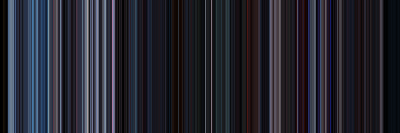

# Movie Frame Poster Generator

Creates a movie poster based on a .mp4 file of your choosing. The poster consists of lines representing the colors of each frame in the movie. 

You can edit the properties of the generated poster. These include:
- **Number of frames**: The number of frames (lines) represented in the poster.
- **Width-to-height ratio**: e.g. if poster width is 400 and ration is 2, poster height will be 200).
- **Frame size**: Number of pixels that represent each frame.
-  **Color mode**: A choice of the *Average* or *Most prominent* color per frame.

# How to use
- Select a movie file.
- Select a save directory.
- Set the properties mentioned above (or use defaults).
- Press **Generate Poster**.

# Demo
The following is a demonstration of the program.

The output of the program using _Star Wars: The Empire Strikes Back_ as input.

